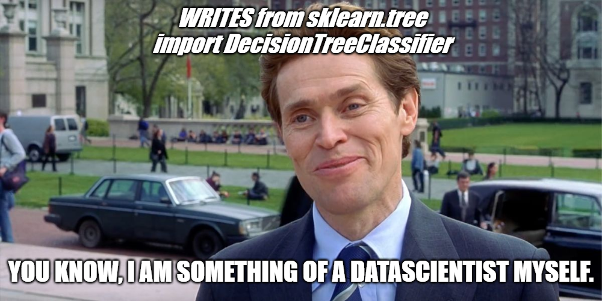
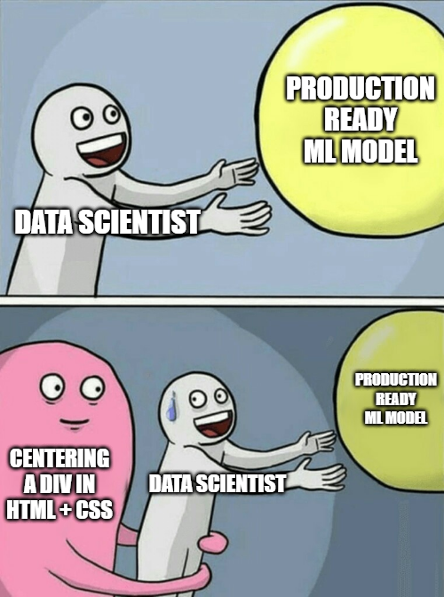
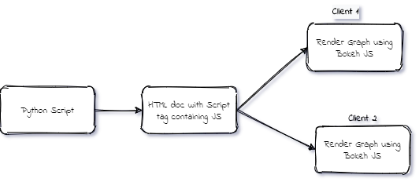
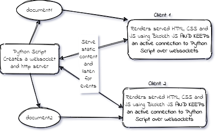
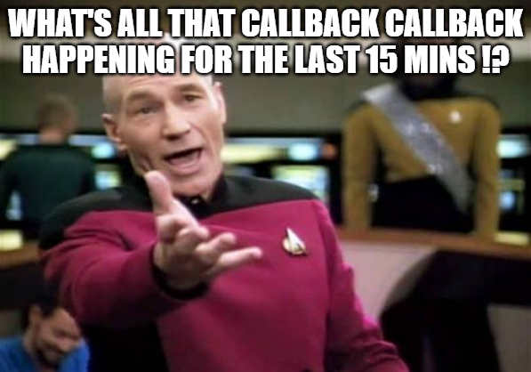
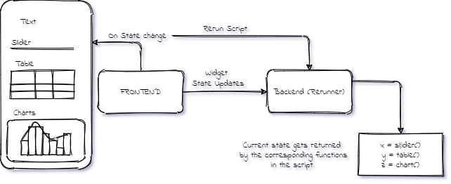
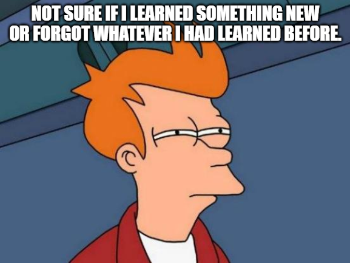

# Session Scope

### To get you up and running with streamlit, bokeh and docker ( backed by pandas and scikit-earn ) and maybe promote open source involvement from ABES IT's IT dept.

### Q. What will I get if I listen to you in the session ?
- We will create something from scratch and deploy it for free on heroku.

- You will get to learn how to create a simple data science oriented project to make your life a little easier in Final year and beyond.

- If you are interested in hackathons you will get to know how can you make something presentable really fast.

---

# Topics

## DataScience centric Application Development

### 1. DataScience
### 2. Application Development in DataScience
### 3. Problems with Application Development for Data Scientists
### 4. Alternatives for application development in Python
### 5. Creating interactive Charts with Bokeh
### 6. Challenges with Bokeh

## Introduction to Streamlit and Custom Component Development

### 7. Skipping callbacks with streamlit
### 8. How Streamlit works under the hood
### 9. Deploying a streamlit app to Heroku with Docker
### 10. Developing custom components for Streamlit
### 11. Uploading to PyPI

--- 
## 1. DataScience

### Q. What is not data science.

Certainly not importing from a bunch of libraries and pasting it in a file.



### Q. What is data science.


### Q. What do we do in datascience.

The whole process of collecting data, exploring data, producing insights from data, predicting based on data and then putting the predictions to production.

--- 
## 2. Application Development in DataScience

### Q. Why do you need to learn how to application dev if you can code very well ?

Because no one cares how well can you code if your output doesnt look good.

### Q. Should I pursue UI/UX then ?

No. Because no one cares how good it looks if the working is crappy.

### Q. What should I do then ?

We will find answer to this in this session. 😊

### So lets look at the challenges with app dev in ds domain.

---
## 3. Problems with Application Development for Data Scientists



Data Scientists/Engineers are not UI/UX or Frontend people. *mostly*

We want to focus on logic not on beauty. And we often dont even know how to make things look beautiful.


### Q. So make it ugly who cares ?

Managers. Clients. and Your project evaluators as well. 😛

---

## 4. Alternatives for Application Development in Python

Data Centric apps can be built using these libs -

1. Bokeh
2. Dash
3. Panel
4. Voila!
5. Streamlit

### Q. I dont have to learn all of them if they serve the same purpose, right ?
Yes but they are not exactly the same.

Bokeh is good at one thing, Dash is at other, Streamlit at other..

### Q. What does a Data centric app look like ?

https://covid19.who.int/explorer


It has 2 things.

1. Graphs
2. Widgets

Widgets feed values, Graphs show those values.

### So we need a library that does graphing and widgeting properly!

### Lets focus on the first part. Graphs. We will explore it with Bokeh.

## 5. Creating interactive Charts with Bokeh

Bokeh works in 2 ways.

1. standalone
2. bidirectional

### 1. Standalone



How to serve ?

Just serve the created HTML file using any static HTTP server. 

### 2. Bidirectional



How to serve ?

Bokeh provides a server as a cli !

just run this

```python
bokeh serve my_app.py
```

## 6. Challenges with Bokeh

#### Bokeh is absolutely awesome for graphing but handling widget's callbacks is .. 😫😫😫



#### Also we have to write some JS sometimes.

### Q. How can I make my life easier then ?

Enter Streamlit !

## 7. Skipping callbacks with streamlit


## 8. How Streamlit works under the hood



## 9. Deploying a streamlit app to Heroku with Docker

### Q. Docker? What?

Its a containerization tool to bundle all of your application's dependencies ( including the OS ) into one small image that can be run anywhere on anyone's system having docker installed.

### Q. So is it like a virtual machine ?

Yes *like* a VM but way more lighter than a VM. It doesnt hold system resources the way the VMs do. It doesnt talk directly to the kernel to give it resources so creating and destroying these containers is pretty fast !

### Q. How can I create one container ?

You need an image, and then you can run that image to create container.
Container is equivalent of an installed copy of an OS. And the ISO that you burn on a CD/pendrive to install the OS has its equivalent as Docker image.

### Q. OK ! THEN TELL ME HOW TO CREATE AN IMAGE !? 😠

Lets explore it with containerization of streamlit app.

### Q. Nice I have an image now how can I deploy it on Heroku ?

[Go to this repo and follow the steps!](https://github.com/ash2shukla/streamlit-heroku)

## 10. Developing custom components for Streamlit

### Q. So that was nice and all but am I constrained only to what streamlit provides me in terms of widgets ? 😒

No. you can create your own widgets using streamlit component library!

Lets create one!

[Refer to this tutorial for future reference](https://streamlit-components-tutorial.netlify.app/) Credits: [@andfanilo](https://github.com/andfanilo)

BEWARE: Javascript ahead.

## 11. Publishing your component to PyPI.

### Q. I have developed an awesome component that I want to contribute to open source. How can I do it ?

You bundle the component and upload it to PyPi ! THen people can install your component like you install other's libraries !

Lets publish our component !

---
## And we wrap the session now!



## For any questions raise an issue in this repo or reach out to me at Linkedin or mail me at ash2shukla@gmail.com !


## If you liked the content leave a ⭐ ! 
---
