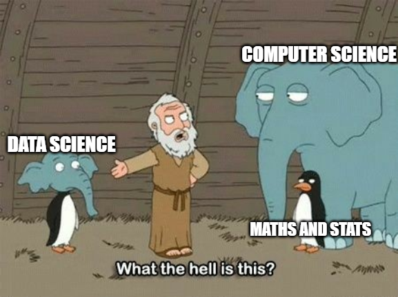

# Session Scope

### To get you up and running with streamlit, bokeh and docker ( backed by pandas and scikit-earn ) and maybe promote open source involvement from ABES IT's IT dept.

### Q. What will I get if I listen to you in the session ?
We will create something from scratch and deploy it for free on heroku.

You will get to learn how to create a simple data science oriented project to make your life a little easier in Final year and beyond.

If you are interested in hackathons you will get to know how can you make something presentable really fast.

---

# Topics

## DataScience centric Application Development

### 1. DataScience
### 2. Application Development in DataScience
### 3. Problems with Application Development for Data Scientists
### 4. Alternatives for application development in Python
### 5. Creating interactive Charts with Bokeh
### 6. Challenges with Bokeh

## Introduction to Streamlit and Custom Component Development

### 7. Skipping callbacks with streamlit
### 8. How Streamlit works under the hood
### 9. Deploying a streamlit app to Heroku with Docker
### 10. Developing custom components for Streamlit
### 11. Uploading to PyPI

--- 
## 1. DataScience

### Q. What is not data science.

Certainly not importing from a bunch of libraries and pasting it in a file.

### Q. What is data science.

The whole process of collecting data, exploring data, producing insights from data, predicting based on data and then putting the predictions to production.

--- 
## 2. Application Development in DataScience

### Q. Why do you need to learn how to application dev if you can code very well ?

Because no one cares how well can you code if your output doesnt look good.

### Q. Should I pursue UI/UX then ?

No. Because no one cares how good it looks if the working is crappy.

### Q. What should I do then ?

We will find answer to this in this session. 😊

### So lets look at the challenges with app dev in ds domain.

---
## 3. Problems with Application Development for Data Scientists

Data Scientists/Engineers are not UI/UX or Frontend people. *mostly*

We want to focus on logic not on beauty. And we often dont even know how to make things look beautiful.

### Q. So make it ugly who cares ?

Managers. Clients. and Your project evaluators as well. 😛

---

## 4. Alternatives for Application Development in Python

Data Centric apps can be built using these libs -

1. Bokeh
2. Dash
3. Panel
4. Streamlit

### Q. I dont have to learn all of them if they serve the same purpose, right ?
Yes but they are not exactly the same.

Bokeh is good at one thing, Dash is at other, Streamlit at other..

### What does a Data centric app look like ?
It has 2 things.

1. Graphs
2. Widgets

Widgets feed values, Graphs show those values.

### So we need a library that does graphing and widgeting properly!

### Lets focus on the first part. Graphs. We will explore it with Bokeh.

